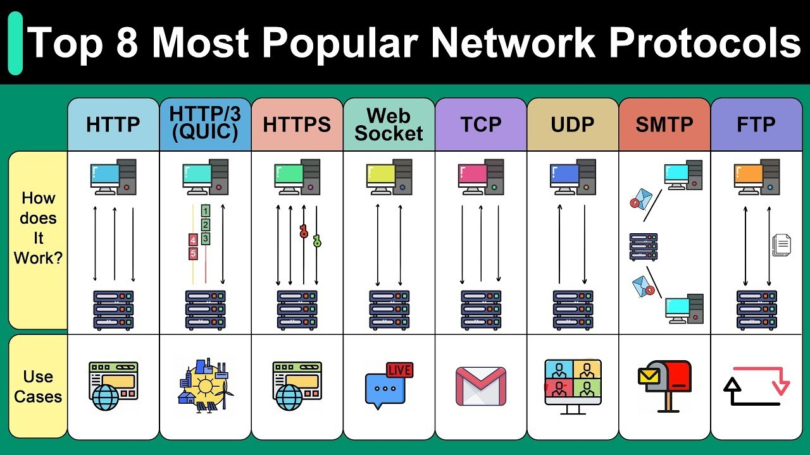
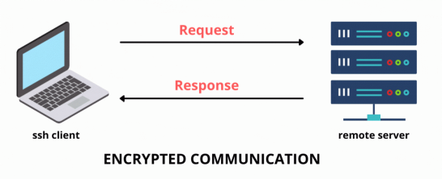
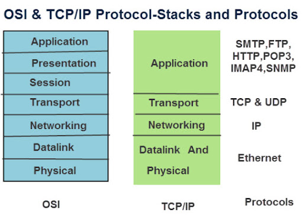
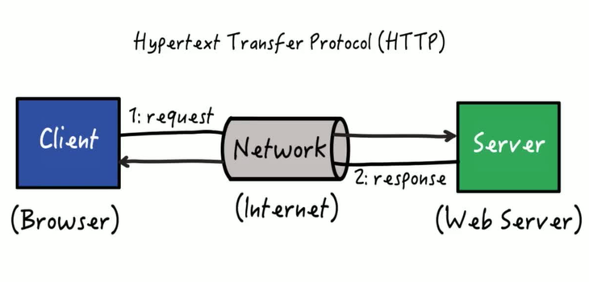
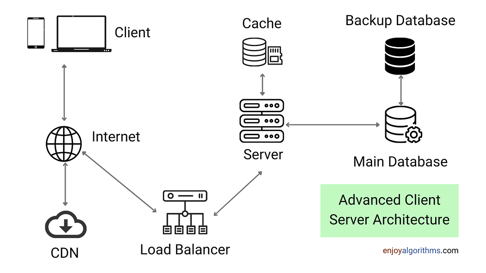
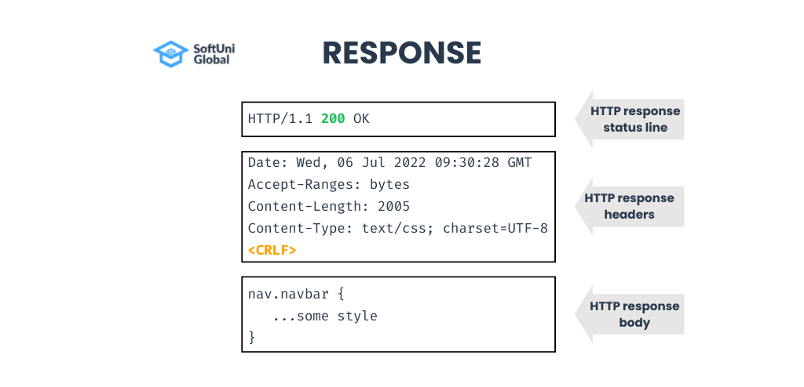

# Understanding Networking and Architecture in Web Development

## 1. What is an IP Address?

Think of an **IP Address** like the address of your home. Just as your home address tells people where to find you, an IP address tells other computers on the internet where to find your device. Every device that connects to the internet, like your computer, phone, or even smart fridge, has an IP address.


### Real-World Example:
Imagine you want to send a letter to a friend. You write their home address on the envelope so the post office knows where to deliver it. Similarly, when your computer sends data (like a web page request) across the internet, it includes the IP address so the data knows where to go.

### Types of IP Addresses:
- **Public IP Address**: Like the main gate of an apartment complex. It's visible to the outside world.
- **Private IP Address**: Like your apartment number within the complex. It's only used inside the network (e.g., your home Wi-Fi).

**Example**: A website like Google might have a public IP address like `142.250.72.14`. Your computer at home might have a private IP address like `192.168.1.2`.

## 2. What is a Port?

If an IP address is like the address of your home, a **Port** is like the different doors in your home. Each door might lead to a different room or serve a different purpose. Similarly, ports allow different kinds of internet traffic to be directed to the right services on your computer.

### Real-World Example:
Imagine you have a mailbox for letters, a doorbell for guests, and a back door for deliveries. Each of these is like a different port on your computer, handling different types of traffic.

### Common Ports:
- **Port 80**: Like the front door for web traffic (HTTP).
- **Port 443**: Like a secure door for encrypted web traffic (HTTPS).
- **Port 22**: Like a locked door with a key for remote access (SSH).

**Example**: When you visit `http://example.com`, your browser uses port 80 by default. If you connect to a server via SSH, you use port 22.

## 3. What is a Socket Address?

A **Socket Address** is the combination of an IP address and a port number. It's like knowing both the apartment complex address (IP address) and the specific apartment number (port).

### Real-World Example:
If you want to send a package to a specific person living in an apartment complex, you need both the building's address and their apartment number. Similarly, a socket address lets data know exactly where to go.

**Example**: `192.168.0.1:8080` – This tells the data to go to IP address `192.168.0.1` and to the service running on port `8080`.


## 4. What is Localhost?

**Localhost** is a term used to refer to your own computer, like talking about yourself. The IP address for localhost is always `127.0.0.1`, and it’s used when a program on your computer wants to talk to another program on the same computer.

### Real-World Example:
Imagine you're reading a book aloud to yourself. You're the speaker and the listener at the same time. Similarly, localhost is your computer talking to itself.

**Example**: If you run a web server on your computer, you can visit it by typing `http://127.0.0.1` or `http://localhost` in your web browser.

## 5. What are Protocols?

**Protocols** are like languages that computers use to communicate. Just like how we use English, Spanish, or other languages to talk to each other, computers use protocols to exchange data.

### Real-World Example:
Imagine you’re at an international conference where people speak different languages. For everyone to understand each other, they use translators. Protocols are like these translators, ensuring that data is understood by both the sending and receiving computers.

### Common Protocols:
- **HTTP (HyperText Transfer Protocol)**: The language of the web, used for browsing websites.
- **HTTPS (Secure HTTP)**: A secure version of HTTP, used for secure browsing (like online banking).
- **FTP (File Transfer Protocol)**: Used for transferring files between computers.
- **SSH (Secure Shell)**: Used for securely accessing a remote computer.




**Example**: When you visit a website, your browser and the website use HTTP or HTTPS to communicate and exchange data.

## 6. What is SSH (Secure Shell)?

**SSH** is like a secure telephone line that lets you connect to another computer from anywhere in the world. It’s commonly used by developers to manage servers remotely, ensuring that the connection is encrypted and secure.

### Real-World Example:
Think of SSH as a secret phone call where no one else can listen in. You use it to talk to someone (a server) securely.

**Example**: If you want to manage a website hosted on a remote server, you can use SSH to log in securely from your computer.

```bash
ssh username@remote-server-ip
```




## 7. Understanding Network Stack Layers

The **Network Stack Layers** are like the different levels of service when you send a package through a courier. Each layer has a specific job, from picking up the package to delivering it to the recipient.

### Real-World Example:
- **Link Layer**: Like the delivery truck that picks up your package.
- **Internet Layer**: Like the highway system that the truck uses to travel.
- **Transport Layer**: Like the address on the package, ensuring it gets to the right place.
- **Application Layer**: Like the recipient who receives the package.

### The Layers of the TCP/IP Model:
1. **Application Layer**: Where applications (like your web browser) operate.
2. **Transport Layer**: Ensures data is sent and received correctly.
3. **Internet Layer**: Handles the movement of data across networks.
4. **Link Layer**: Deals with physical hardware, like network cables and Wi-Fi.



**Example**: When you send an email, each layer of the TCP/IP model plays a role in getting that email from your computer to the recipient’s inbox.

## 8. What is the HTTP Protocol?

**HTTP (HyperText Transfer Protocol)** is the set of rules that web browsers and web servers use to communicate. It’s how information like web pages, images, and videos are transferred over the internet.

### Real-World Example:
Imagine you’re ordering food at a restaurant. You (the client) give your order to the waiter (the server), and the waiter brings your food back to you. HTTP works in a similar way.

### Steps in an HTTP Request:
1. **Request**: Your browser asks the server for a web page.
2. **Response**: The server sends the requested page back to your browser.

**Example**: When you type `www.google.com` in your browser, your browser sends an HTTP request to Google’s server, and the server responds with Google’s homepage.



## 9. What is Client-Server Architecture?

In **Client-Server Architecture**, the client (like your web browser) requests services, and the server (like the website’s server) provides those services. This is the basic structure of how the internet works.

### Real-World Example:
Imagine you walk into a library (the server) and ask the librarian (the client) for a book. The librarian finds the book and gives it to you. Similarly, your browser (client) asks a web server for a webpage, and the server delivers it.

**Example**: When you browse Facebook, your device (client) requests data from Facebook’s servers (server), which then send back the data needed to display your news feed.




## 11. What is an HTTP Response?

An **HTTP Response** is what a server sends back to your browser after it receives your request. It includes the content you requested, such as a web page, image, or file, as well as important information about that content.

### Real-World Example:
When you ask for a book in a library, the librarian brings you the book (the response) along with some information about it, like the title and author.

### Components of an HTTP Response:
- **Status Code**: Tells you whether the request was successful (e.g., 200 OK) or if there was an issue (e.g., 404 Not Found).

### 1. **HTTP Method**
   - **What is it?**  
     HTTP methods are the actions that a client wants to perform on a resource on the server. Common methods include `GET`, `POST`, `PUT`, and `DELETE`.
   - **Real-Life Example:**  
     - **GET:** Asking a library for a specific book.
     - **POST:** Submitting a new book to the library.
     - **PUT:** Updating the details of an existing book in the library.
     - **DELETE:** Removing a book from the library.
   - **Use Case:**  
     - **GET:** Your browser uses `GET` to retrieve web pages.
     - **POST:** When you submit a form online, your browser uses `POST` to send that data to the server.

### 2. **Request Header**
   - **What is it?**  
     A request header is additional information sent with an HTTP request, providing context about the request, such as the type of data being sent, who is sending it, and how the response should be formatted.
   - **Real-Life Example:**  
     When you mail a package, you include a return address, special delivery instructions, and information about the contents. These details help the postal service process your package correctly.
   - **Use Case:**  
     Common request headers include:
     - **Content-Type:** Specifies the type of data (e.g., `application/json`).
     - **User-Agent:** Identifies the browser or device making the

 request.

### 3. **Request Body**
   - **What is it?**  
     The request body contains the actual data that the client wants to send to the server. It’s used in methods like `POST` or `PUT` where you’re submitting data (e.g., a form).
   - **Real-Life Example:**  
     If you’re filling out an online survey, the answers you submit are like the request body. It’s the main content that needs to be sent to the server for processing.
   - **Use Case:**  
     When you upload a file or submit a form, the data you’ve entered is included in the request body and sent to the server for handling.



This response tells your browser that the request was successful (200 OK) and includes the HTML content of the webpage.

## 12. What is a Server?

A **Server** is a powerful computer that stores data, applications, and resources and provides them to other computers, known as clients, over a network.

### Real-World Example:
Think of a server as a large warehouse where goods (data) are stored. When you need something, you request it, and the warehouse delivers it to you.

**Example**: When you use Google Drive, the files you store there are kept on Google’s servers. When you want to access a file, your computer (the client) requests it, and the server sends it to you.


### 13. **HTTPS**
   - **What is it?**  
     HTTPS (HyperText Transfer Protocol Secure) is an extension of HTTP that includes encryption for secure communication over the internet. It protects data from being intercepted by unauthorized parties.
   - **Real-Life Example:**  
     Sending a message through a secure, locked box that only the recipient can open. Even if someone intercepts it, they can’t read the contents.
   - **Use Case:**  
     When you enter sensitive information like credit card details on a website, HTTPS ensures that this data is encrypted, making it safe from eavesdroppers.